# WhatsApp Integration - Detailed User Flows

This document describes all user flows in the Sociovia WhatsApp integration.

---

## 1. Account Setup Flow

```mermaid
flowchart TD
    A[User logs into Sociovia] --> B[Navigate to WhatsApp Settings]
    B --> C[Click 'Connect WhatsApp']
    C --> D[Facebook Login Popup Opens]
    D --> E[User logs in with Facebook]
    E --> F[User grants WhatsApp permissions]
    F --> G[User selects/creates WABA]
    G --> H[User verifies phone number]
    H --> I[OAuth callback to backend]
    I --> J[Token stored in database]
    J --> K[User redirected to Settings]
    K --> L[Account appears in list ✅]
```



### Steps:
1. **Login to Sociovia** → User authenticates with their Sociovia account
2. **Navigate to Settings** → Go to Dashboard → WhatsApp → Settings
3. **Connect Account** → Click "Connect WhatsApp Business Account"
4. **Facebook OAuth** → Login popup, grant permissions
5. **Select/Create WABA** → Choose existing or create new WhatsApp Business Account
6. **Verify Phone** → Enter verification code sent to the phone number
7. **Account Ready** → Account appears in the Connected Accounts list

---

## 2. WhatsApp Inbox Flow


### Inbox Features:
| Feature | Description |
|---------|-------------|
| **Conversation List** | Shows all chats with unread counts, session badges |
| **Session Badge** | Green with countdown (23h 14m) = Active, Grey = Expired/Closed |
| **Search** | Filter conversations by name/phone |
| **Refresh** | Auto-refresh every 5 seconds |

---

## 3. Messaging Flow

### 3.1 Sending Text Messages (Open Session)

```mermaid
flowchart TD
    A[User types message] --> B{Is session open?}
    B -->|Yes| C[Click Send]
    C --> D[POST /api/whatsapp/message]
    D --> E{Backend checks closed_by_agent}
    E -->|Not closed| F[Send via WhatsApp API]
    E -->|Closed| G[Return error]
    F --> H[Message appears in thread ✅]
    G --> I[Show error toast ❌]
    B -->|No| J[Input disabled with helper text]
```



### 3.2 Sending Template Messages (Any Session)

```mermaid
flowchart TD
    A[User clicks Template icon] --> B[Template Picker opens]
    B --> C[Select template]
    C --> D[Fill in variables if needed]
    D --> E[Click Send Template]
    E --> F[POST /api/whatsapp/message/template]
    F --> G[Template sent via API]
    G --> H[Creates/Extends 24hr session]
    H --> I[Message appears in thread ✅]
```



---

## 4. Session Management Flow

### The 24-Hour Rule:
- **Customer initiates** → 24-hour session opens
- **Business sends template** → Creates session if none exists
- **Customer replies** → Resets 24-hour timer
- **Session expires** → Can only send templates

### Close/Reopen Flow:

```mermaid
flowchart TD
    A[Chat has open session] --> B[User clicks 'Close Chat']
    B --> C[PATCH /conversations/{id}/close]
    C --> D[closed_by_agent = true]
    D --> E[Message input disabled]
    E --> F[User can still send templates]
    
    G[Chat is closed] --> H[User clicks 'Reopen']
    H --> I[PATCH /conversations/{id}/reopen]
    I --> J[closed_by_agent = false]
    J --> K{Was session still valid?}
    K -->|Yes| L[Can send text messages again]
    K -->|No| M[Still needs template to open session]
```

---

## 5. New Chat Flow (Starting Conversation with New Number)


---

## 6. Analytics Flow

### 6.1 Chat-Specific Analytics

```mermaid
flowchart LR
    A[In conversation thread] --> B[Click 'Stats' button]
    B --> C[Navigate to /analytics?conversation=ID]
    C --> D[Fetch /analytics/conversations/{id}]
    D --> E[Show single chat stats]
```

**What it shows:**
- Session status (active/expired/closed)
- Message counts (total, incoming, outgoing)
- Delivery & Read rates
- Templates used in this chat

### 6.2 Overall Analytics


**What it shows:**
- Total messages across all chats
- Delivery rates, read rates
- Template performance by category
- Daily trends

---

## 7. Account Management Flow

### Rename Account
```
Settings → Account Card → Manage → Rename → Enter new name → Save
```

### Unlink Account
```
Settings → Account Card → Manage → Unlink → Confirm → Token revoked
```

### Delete Account
```
Settings → Account Card → Manage → Delete → Confirm → Account removed from database
```

### Re-link Account
```
Settings → Account Card (Inactive) → Manage → Re-link → Facebook OAuth → New token saved
```

---

## 8. Error Handling Flows

| Scenario | User Experience |
|----------|-----------------|
| **Session expired** | Message box disabled, shows "Use template to start" |
| **Closed by agent** | Message box disabled, shows "Reopen or use template" |
| **API rate limited** | Toast: "Too many requests, try later" |
| **Template rejected** | Toast: "Template not approved by Meta" |
| **Network error** | Toast: "Connection failed, retrying..." |
| **Webhook missed** | Polling catches up within 5 seconds |

---

## 9. Quick Reference: UI States

### Conversation Session Badges

| Badge | Meaning | Actions Allowed |
|-------|---------|-----------------|
| 🟢 **23h 14m** | Active session | Text + Templates |
| ⚪ **Expired** | 24hrs passed | Templates only |
| 🔴 **Closed** | Agent closed | Templates only |
| 🟡 **Waiting** | No customer msg yet | Templates only |

### Message Status Icons

| Icon | Status |
|------|--------|
| ⏳ | Sending |
| ✓ | Sent |
| ✓✓ | Delivered |
| ✓✓ (blue) | Read |
| ❌ | Failed |

---

## 10. Complete Journey Example

### Scenario: Support Agent Handles Customer Query

1. **Customer initiates** → Sends "Hi, I need help with my order"
2. **Agent receives** → Notification appears, conversation shows in inbox
3. **Agent opens chat** → Sees message with 24h session badge
4. **Agent replies** → Types response, clicks send
5. **Customer replies** → Session timer resets to 24h
6. **Issue resolved** → Agent clicks "Close Chat"
7. **Customer returns next week** → Sends new message
8. **Session renewed** → Agent can chat normally again
9. **Agent checks stats** → Clicks "Stats" to see delivery rates
10. **Admin reviews** → Opens Overall Analytics in Settings
